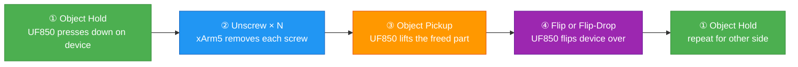
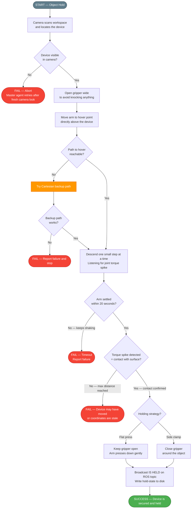
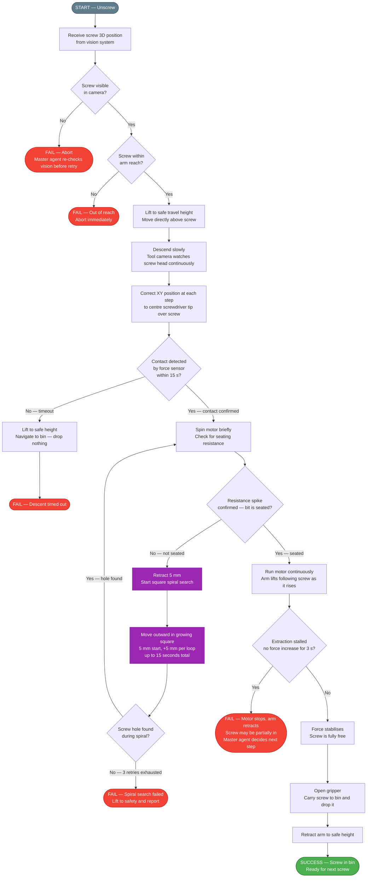
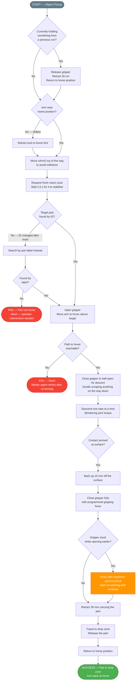
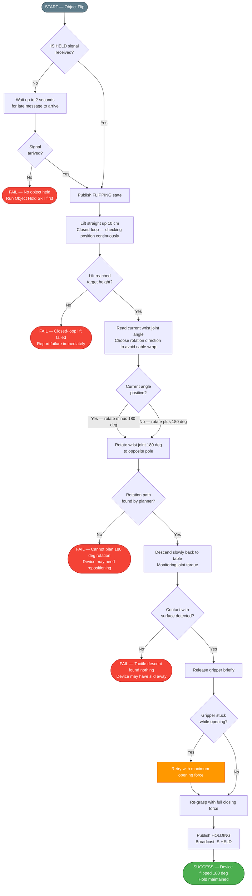
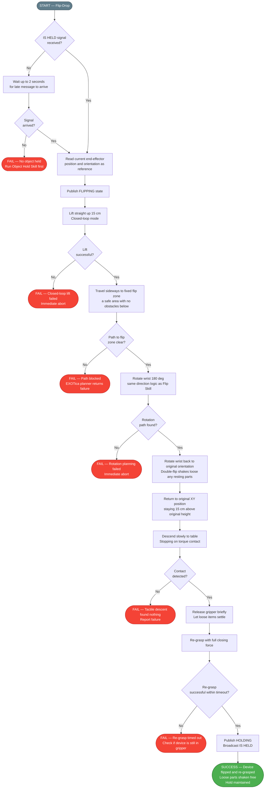
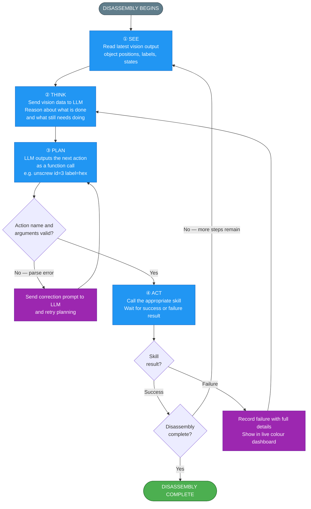

# Disassembly Skills — Architecture Flowcharts

Each section contains a Mermaid flowchart for one skill showing the success path, every failure point, and how the system recovers.

**To export as an image:** paste any `mermaid` block into **https://mermaid.live**, then click the PNG or SVG download button.

---

## How the Skills Chain Together

---

## 1. Object Hold Skill

---

## 2. Unscrew Skill

---

## 3. Object Pickup Skill

---

## 4. Object Flip Skill

---

## 5. Flip-Drop Skill

---

## 6. Master Agent (Orchestrator)

---

## Quick Reference

| Skill | Arm | Happy-path steps | Key recovery mechanism |
|---|---|---|---|
| Object Hold | UF850 | 6 | Cartesian backup path |
| Unscrew | xArm5 | 9 | Square spiral search outward from 5 mm |
| Object Pickup | UF850 | 13 | Label fallback + joint-space retract |
| Object Flip | UF850 | 7 | Wait 2 s for hold signal |
| Flip-Drop | UF850 | 10 | Same hold-wait as Flip Skill |
